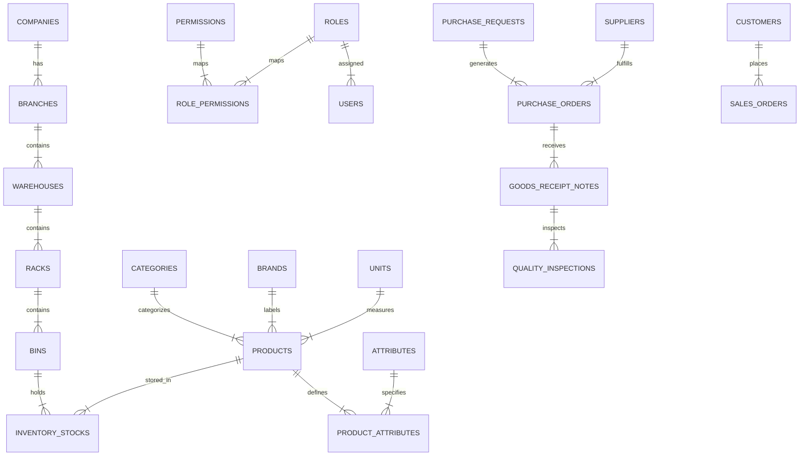

# Enterprise ERP Entity Relationship (ER) Diagram

```mermaid
erDiagram
    COMPANIES ||--|{ BRANCHES : has
    BRANCHES ||--|{ WAREHOUSES : contains
    WAREHOUSES ||--|{ RACKS : contains
    RACKS ||--|{ BINS : contains
    ROLES ||--|{ USERS : assigned
    ROLES ||--|{ ROLE_PERMISSIONS : maps
    PERMISSIONS ||--|{ ROLE_PERMISSIONS : maps
    CATEGORIES ||--|{ PRODUCTS : categorizes
    BRANDS ||--|{ PRODUCTS : labels
    UNITS ||--|{ PRODUCTS : measures
    PRODUCTS ||--|{ PRODUCT_ATTRIBUTES : defines
    ATTRIBUTES ||--|{ PRODUCT_ATTRIBUTES : specifies
    SUPPLIERS ||--|{ PURCHASE_ORDERS : fulfills
    PRODUCTS ||--|{ INVENTORY_STOCKS : stored_in
    BINS ||--|{ INVENTORY_STOCKS : holds
    PURCHASE_REQUESTS ||--|{ PURCHASE_ORDERS : generates
    PURCHASE_ORDERS ||--|{ GOODS_RECEIPT_NOTES : receives
    GOODS_RECEIPT_NOTES ||--|{ QUALITY_INSPECTIONS : inspects
    CUSTOMERS ||--|{ SALES_ORDERS : places
```
